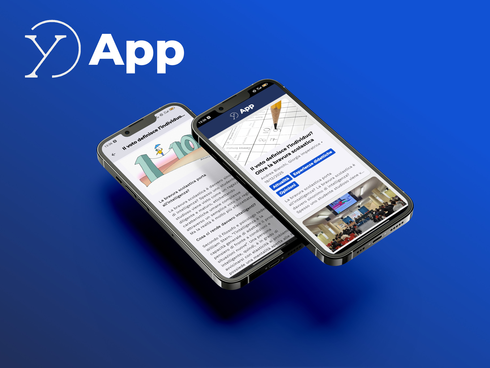

# YES-App

<h1 align=center>
    <picture>
        
    </picture>
</h1>


# Italiano

> [!WARNING]
> Qeusta applicazione non verrà per il momento pubblicata sul Google Play Store o sull'Apple App Store, in quanto ciò:
> 1. Richiede spese che non intendo attualmente effettuare
> 2. Richiede l'immissione di dati personali come l'indirizzo di casa e il numero di telefono. Potrei creare un account business, ma questo richiederebbe altre spese e burocrazia che non posso sostenere al momento.
---

Questa applicazione ha lo scopo di consentire una più facile lettura degli articoli dal sito del giornalino scolastico [live.iiseinaudiscarpa.edu.it/yes-site](https://live.iiseinaudiscarpa.edu.it/yes-site).

Al momento, non c'è ancora una versione per l'iPhone, in quanto non possiedo un dispositivo appropriato per testare l'applicazione né un Account Sviluppatore Apple.

Il codice è basato su Flutter 3 (con la sicurezza null inclusa) quindi è abbastanza certo il fatto che tu, utente, possa compilartelo tranquillamente utilizzando l'ultima versione del Flutter SDK.

## Come installare

### Dall'app store

L'applicazione sarà a breve disponibile su F-Droid.

### Manualmente

1. Scarica l'APK più recente dalla sezione [Releases](https://github.com/Zac06/yes-app/releases) (o il bottone qui sotto) appropriata per la tua piattaforma. In caso di dubbio, scarica l'APK "universale".

<h1 align=center>
    <a href="https://github.com/Zac06/yes-app/releases/latest"><picture>
        
    </picture></a>
</h1>

2. Abilita l'installazione da fonti sconosciute sul tuo dispositivo Android.
3. Apri il file APK scaricato e segui le istruzioni.
4. Divertiti!

## Compilalo tu stesso

1. Clona questo repository
2. Esegui
    ```
    flutter pub get
    ```
3. Firma il tuo APK (**facoltativo**)
4. Esegui
    ```
    flutter build apk --release
    ```

    Questo compilerà ogni piattaforma in UN unico grande APK. Per compilare binari specifici per piattaforma:

    ```
    flutter build apk --release --split-per-abi
    ```

    E installa il binario appropriato per le tue esigenze.

---

# English

> [!WARNING]
> This application will not be published on Google Play Store or Apple App Store, since it 
> 1. Involves unnecessary fees I do not intend to spend
> 2. Requires inputting personal information such as address and phone number. I could set up a company account, but that also involves fees and additional bureaucracy that I can't go through at the moment.

---

This application is meant to allow easier article reading from the [live.iiseinaudiscarpa.edu.it/yes-site](https://live.iiseinaudiscarpa.edu.it/yes-site) school news website.

There is not yet an iPhone version, since i do not possess an appropriate testing device nor an Apple Developer Account.

The code uses Flutter 3 (with null safety) so it's safe to say that you can also compile it yourself without much trouble by using the latest version of the Flutter SDK.

## Installation instructions

### From an app store

The application is going to be available on F-Droid.

### Manually

1. Download the latest APK from the [Releases](https://github.com/Zac06/yes-app/releases) (or the underlying button) appropriate for your platform. If in doubt, download the "universal" APK.

<h1 align=center>
    <a href="https://github.com/Zac06/yes-app/releases/latest"><picture>
        
    </picture></a>
</h1>

2. Enable installation from unknown sources on your Android device.
3. Open the downloaded APK file and follow the instructions.
4. Enjoy!

## Compile it yourself

1. Clone this repository
2. Run
    ```
    flutter pub get
    ```
3. Sign your APK (**optional**)
4. Run
    ```
    flutter build apk --release
    ```

    This will compile every platform in ONE large APK. To compile platform-specific binaries:

    ```
    flutter build apk --release --split-per-abi
    ```

    And install the binary appropriate for your needs.